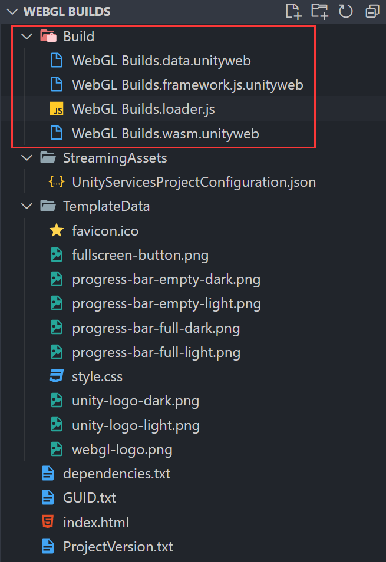

## 前言

制作游戏一直都是我比较感兴趣的一件事情。
这次有时间自己尝试了一下，发现过程上其实还挺简单的，
关键的可能还是需要对前端有一些基本的认识，然后知道WebGL、WebAssembly啥的，
这样在实践的时候不会在大方向上出现问题。

这篇文章会复现整个项目的制作流成，目的是提供一个大致清晰的制作方向给大家。

## 制作你的Unity游戏

这块会使用到的就是一个比较成熟的Unity工具链。
这个例子当中，我使用的是一个Unity社区当中的教程模板[Karting Microgame](https://learn.u3d.cn/tutorial/unity-microgame-karting#)，你可以在Unity Hub中新建项目的时候找到它的模板。
这个模板中会简单的教会你一些Unity的使用（包括测试、修改属性、添加物体、发布等），
当你简单地对Unity有了了解之后，你就可以尝试打包发布你的游戏。

打包完成之后你会得到如下图所示的目录结构：

其中`Build`目录下的就是我们游戏打包出来的主体，其它外部的是一些默认的配置和资源。
我们可以利用Node的[http-server](https://www.npmjs.com/package/http-server)，
在`WebGL Builds`（或者对应的打包出来的根目录）起一个HTTP Server，
这样就可以在浏览器中看到游戏是否在正常运行。

### 打包时可能会遇到的问题

在Unity默认配置下打包的时候，可能发布出来的游戏在加载阶段会报无法加载gzip的报错，修改了HTTP Server的配置可能还是会出同样的报错。

这个问题目前判断下来是因为Unity内核的一些问题导致，
所以可能需要修改一下在`Edit/Project Settings/Player/Settings for WebGL`下的打包目标的配置，
配置方法可以参考下图：

## 将Unity游戏嵌入到React项目当中

> 待完成的内容...